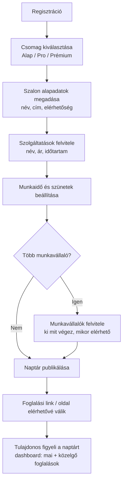
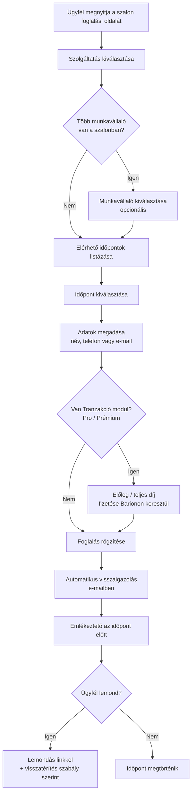
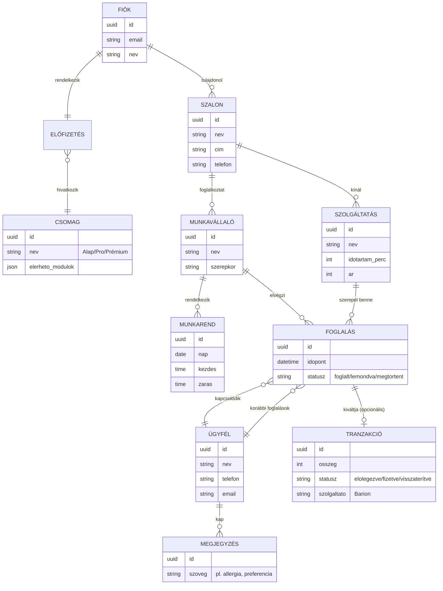
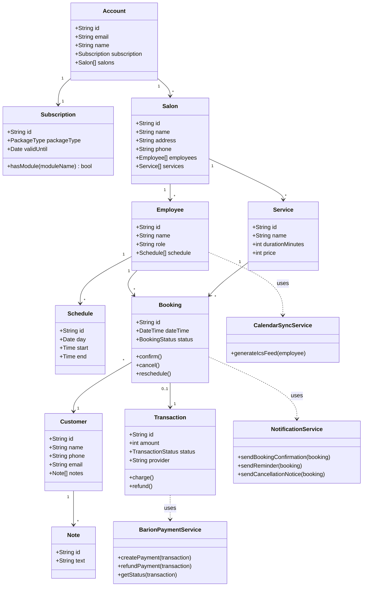

# Időpontfoglaló Platform – Koncepciós Dokumentum

### (Fodrász, Kozmetikus szalonok számára – "Projekt János")

---

## 1. Probléma és célközönség

### 1.1 A probléma

Kis- és középméretű szépségipari szolgáltatók (fodrász, kozmetikus, körömszalon stb.) ma jellemzően:

- telefonon vagy Messengeren egyeztetik az időpontokat, ami sok manuális adminisztrációt és hibalehetőséget jelent,
- nem látják át egyben a több alkalmazott/több telephely elérhetőségét,
- sokat veszítenek az utolsó pillanatban lemondott vagy meg nem jelenő ügyfelek miatt (no-show),
- nem gyűjtenek strukturált adatot a visszatérő ügyfelekről (preferenciák, allergiák, előzmények),
- nincs egységes, ügyfélbarát online felületük a foglalásra – sokszor csak egy Facebook oldal vagy telefonszám létezik.

### 1.2 Célközönség – szalontulajdonos / menedzser (a fizető ügyfél)

- 1–10 fős szépségipari vállalkozások (egyéni vállalkozó vagy kisebb csapat).
- Nem feltétlenül technikai háttérrel rendelkező felhasználók → a felületnek egyszerűnek, gyorsan beüzemelhetőnek kell lennie.
- Igény: kevesebb adminisztráció, kevesebb no-show, professzionálisabb megjelenés az ügyfelek felé.

### 1.3 Végfelhasználó – az ügyfél (aki időpontot foglal)

- Nem regisztrál fiókot, gyorsan, 2–3 kattintással szeretne időpontot foglalni.
- Elvárás: azonnali visszaigazolás, emlékeztető, egyszerű lemondás/átfoglalás lehetősége.

---

## 2. Funkciólista – MVP vs. jövőbeli funkciók

| Terület              | MVP (induláshoz szükséges)                                                                                                                                              | Később bevezetendő                                                                                                       |
| -------------------- | ----------------------------------------------------------------------------------------------------------------------------------------------------------------------- | ------------------------------------------------------------------------------------------------------------------------ |
| **Naptár modul**     | Szolgáltatások, árak, időtartamok kezelése; munkaidő beállítás; 1 munkavállaló kezelése; szabad/foglalt slotok automatikus számítása; ügyféloldali foglalás fiók nélkül | Több munkavállaló komplex beosztáskészítővel (műszakcsere, szabadság kezelése); erőforrás-alapú foglalás (pl. szék, gép) |
| **Értesítés modul**  | E-mail visszaigazolás; e-mail emlékeztető (24 óra); lemondás/átfoglalás linkkel                                                                                         | SMS értesítés; WhatsApp/Viber integráció; Google/Outlook naptár szinkron (.ics); ügyfélszegmentálás, célzott kampányok   |
| **Ügyféladatok**     | Alap ügyféllista (név, telefon, e-mail, előzmények)                                                                                                                     | Egyedi megjegyzések (allergia, preferencia) kereshető/szűrhető módon; visszatérő vendég automatikus felismerése          |
| **Tranzakció modul** | – (Pro csomagtól induló funkció, MVP-ben Barion integráció)                                                                                                             | Részleges előleg szabályrendszer; automatikus, szabály alapú visszatérítés                                               |
| **Web modul**        | –                                                                                                                                                                       | Beágyazható iframe/API widget; platform által épített mini weboldal                                                      |
| **Csomagkezelés**    | 3 fix csomagszint (Alap/Pro/Prémium), modulok ki-be kapcsolása csomag szerint                                                                                           | Egyedi, moduláris árazás; több áruház/telephely csoportos kezelése egy fiók alatt                                        |

> **MVP célja:** egyetlen szalon, egyetlen munkavállaló, alap naptár + e-mail értesítés + Barion fizetés működjön stabilan, mielőtt a komplexebb (több alkalmazott, SMS, web modul) funkciók bekerülnek.

---

## 3. Felhasználói folyamatok (User Flow)

### 3.1 Szalontulajdonos – regisztrációtól az első foglalásig

### 3.2 Ügyfél – foglalás menete

---

## 4. Domain modell (entitások és kapcsolatok)

**Megjegyzés a modellhez:** egy Fiók (Account) több Szalonhoz kapcsolódhat (a specifikációban jelzett "egy fiókhoz több áruház csatlakozhat" elv szerint) – ez egy 1:N kapcsolat Fiók és Szalon között, míg az Előfizetés/Csomag a Fiók szintjén dől el, és ez határozza meg, mely modulok érhetők el az összes hozzá tartozó szalonban.

> **MongoDB-s megvalósítás megjegyzése:** a fenti ER-diagram a logikai kapcsolatokat mutatja. MongoDB-ben ez dokumentum-alapú modellezéssel valósul meg: pl. a `SZALON` dokumentum beágyazhatja a `MUNKAVÁLLALÓ` és `SZOLGÁLTATÁS` al-dokumentumokat (ritkán változó, szalononkénti adat), míg a `FOGLALÁS` és `TRANZAKCIÓ` külön kollekcióban, referenciával (`szalon_id`, `ugyfel_id`, `munkavallalo_id`) kapcsolódik hozzájuk – mivel ezek gyakran és nagy számban keletkeznek.

---

## 5. Osztályarchitektúra (backend modulok és fő osztályok)

**Fő architekturális elvek:**

- A **Subscription** (`Előfizetés`) dönti el, mely modulok (Naptár / Értesítés / Tranzakció / Web) aktívak egy Fiókhoz tartozó összes Szalonon – ez a `hasModule()` metódussal ellenőrizhető minden modulhívás előtt (feature-flag jellegű működés).
- A **NotificationService**, **BarionPaymentService** és **CalendarSyncService** külön szolgáltatás-osztályok (NestJS-ben külön modulok), amelyeket a `Booking` és `Transaction` entitások use-case szinten hívnak meg – így ezek a modulok csomagszint szerint önállóan ki- és bekapcsolhatók.
- A **BarionPaymentService** az egyetlen fizetési integráció; nincs más fizetési szolgáltató bevonva a tervbe.

---

## 6. Technológiai döntések

| Réteg                   | Választott technológia                           | Indoklás / megjegyzés                                                                                                                                                                   |
| ----------------------- | ------------------------------------------------ | --------------------------------------------------------------------------------------------------------------------------------------------------------------------------------------- |
| Frontend                | **Next.js**                                      | SSR/ISR támogatás a gyors, SEO-barát ügyféloldali foglalási oldalakhoz; jó illeszkedés egy jövőbeli Web modulhoz is                                                                     |
| Backend                 | **NestJS**                                       | Strukturált, moduláris felépítés – jól illeszkedik a csomag szerinti modul be/kikapcsoláshoz (Naptár, Értesítés, Tranzakció, Web modul külön NestJS modulként)                          |
| Adatbázis               | **MongoDB**                                      | Dokumentum-alapú modell rugalmasan kezeli a szalononként eltérő szolgáltatás- és munkarend-struktúrákat; jól skálázható a nagy számban keletkező Foglalás/Tranzakció adatokra           |
| Fizetés                 | **Barion**                                       | Magyar piacra optimalizált, forintos elszámolás; az egyetlen, véglegesen kiválasztott fizetési szolgáltató                                                                              |
| E-mail értesítés        | **AWS SES**                                      | API-n keresztül integrálható, használat-alapú díjazás (~40 Ft / 1000 e-mail), bevált nagy szolgáltatóknál (Netflix, Duolingo)                                                           |
| SMS értesítés (Prémium) | **Vonage Messages API**                          | Egységes API SMS/MMS/RMS-hez, valamint WhatsApp/Messenger/Viber támogatással; költsége miatt (akár 60 Ft/SMS) csak Prémium csomagban indokolt                                           |
| Naptárszinkron          | **.ics fájl generálás, egyirányú GET végponton** | A szerver generálja a `.ics` feedet munkavállalónként/szalononként; Google Calendar / Outlook ezen keresztül szinkronizál – nincs szükség OAuth-alapú kétirányú integrációra az MVP-ben |

### 6.1 Nyitott kérdések

1. **Web modul iránya:** meglévő weboldalba ágyazható widget (iframe/API) vagy platform által épített mini weboldal – vagy mindkettő, csomagszinttől függően?
2. **Beosztáskészítő modul mélysége:** egyszerű heti munkarend elég-e, vagy kell műszakcsere/szabadságkezelés is már az első verzióban?
3. **Visszatérítési szabályrendszer:** mennyi idővel a foglalás előtt jár teljes/részleges/nincs visszatérítés – ez szalononként testre szabható legyen, vagy platformszintű alapértelmezés legyen?

---

## 7. Csomagszintek összefoglalása

| Modul                                 | Alap | Pro | Prémium |
| ------------------------------------- | :--: | :-: | :-----: |
| Naptár modul                          |  ✅  | ✅  |   ✅    |
| Értesítés modul (e-mail)              |  –   | ✅  |   ✅    |
| Értesítés modul (SMS, naptárszinkron) |  –   |  –  |   ✅    |
| Online Tranzakció modul (Barion)      |  –   | ✅  |   ✅    |
| Web modul                             |  –   |  –  |   ✅    |

---

_A dokumentum a megadott projektleírás alapján készült koncepciós összefoglaló; a nyitott kérdések (6.1 pont) még döntést igényelnek a fejlesztés megkezdése előtt. A kinézeti/UI vázlatok (wireframe) ebből a verzióból szándékosan kimaradtak._